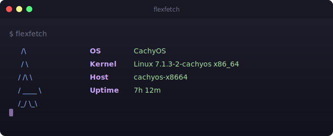
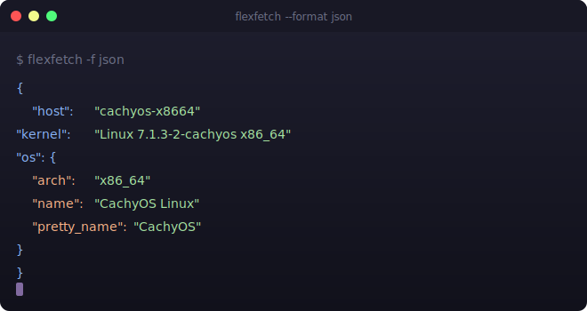

<p align="center">
  
</p>

<h1 align="center">flexfetch</h1>

<p align="center">
  <em>Fast, flexible system info for Linux & macOS • Written in Rust</em>
</p>

<p align="center">
  <a href="https://github.com/mahesh-diwan/flexfetch/releases/latest"></a>
  <a href="https://github.com/mahesh-diwan/flexfetch/actions/workflows/release.yml"></a>
  <a href="LICENSE"></a>
  <a href="https://github.com/mahesh-diwan/flexfetch"></a>
</p>

<p align="center">
  <a href="#features"><kbd>Features</kbd></a>
  <a href="#installation"><kbd>Install</kbd></a>
  <a href="#usage"><kbd>Usage</kbd></a>
  <a href="#modules"><kbd>Modules</kbd></a>
  <a href="#themes"><kbd>Themes</kbd></a>
  <a href="#configuration"><kbd>Config</kbd></a>
  <a href="#lua-plugins"><kbd>Lua</kbd></a>
  <a href="#faq"><kbd>FAQ</kbd></a>
</p>

<br>

## Features

|                                                      |                                                   |                                                                   |
| ---------------------------------------------------- | ------------------------------------------------- | ----------------------------------------------------------------- |
| ⚡ **Rust** — fast, safe, static binary              | 🎨 **ASCII logos** — distro art side-by-side      | 🎭 **5 themes** — Catppuccin, Dracula, Nord, Gruvbox, Tokyo Night |
| 🧩 **19 modules** — 6 working, 13 stubs              | 🔌 **Lua plugins** — extend with scripts          | 📝 **Tera templates** — full layout control                       |
| ⚙️ **TOML config** — choose modules, themes, display | 📊 **JSON output** — machine-readable (`-f json`) | 🚀 **Parallel fetch** — Rayon-powered concurrency                 |
| 🎨 **Color blocks** — 16-color terminal bar          | 🌐 **CI/CD** — GitHub Actions + release tarballs  | 📦 **One-liner** — `curl ... install.sh \| sh`                    |

## Why flexfetch?

|                 | flexfetch                       | neofetch            | fastfetch      | pfetch            |
| --------------- | ------------------------------- | ------------------- | -------------- | ----------------- |
| **Language**    | Rust                            | Bash                | C              | sh                |
| **Plugins**     | Lua 5.4                         | —                   | —              | —                 |
| **Templates**   | Tera (Jinja2/Django)            | —                   | —              | —                 |
| **Config**      | TOML                            | —                   | JSON5          | env vars          |
| **Themes**      | 5 presets + per-field overrides | built-in colors     | custom presets | `PF_COL[1-3]`     |
| **ASCII logos** | 7 distros + generic fallback    | large set           | large set      | small set         |
| **Parallel**    | ✅ (Rayon)                      | —                   | ✅             | —                 |
| **Binary**      | ~5 MB static                    | ~1 MB (Bash script) | ~2 MB          | ~5 KB (sh script) |
| **Deps**        | none at runtime                 | Bash + POSIX utils  | none           | POSIX sh          |

## Installation

### One-liner (pre-built binary, no Rust needed)

```bash
curl -fsSL https://raw.githubusercontent.com/mahesh-diwan/flexfetch/main/install.sh | sh
```

Needs `curl` or `wget` + `sudo`. Detects arch, fetches latest release from GitHub, installs to `/usr/local/bin`.

### Manual download

```bash
# find latest release
TAG=$(curl -s https://api.github.com/repos/mahesh-diwan/flexfetch/releases/latest \
  | grep tag_name | cut -d'"' -f4)
# download + install
wget "https://github.com/mahesh-diwan/flexfetch/releases/download/$TAG/flexfetch-linux-amd64.tar.gz"
tar xzf flexfetch-linux-amd64.tar.gz
sudo mv flexfetch /usr/local/bin/
```

CI builds on every `v*` tag (`.github/workflows/release.yml`). Uploads `flexfetch-linux-amd64.tar.gz` to release assets.

### From source (Rust, includes Lua plugin support)

```bash
git clone https://github.com/mahesh-diwan/flexfetch.git
cd flexfetch
cargo build --release
sudo cp target/release/flexfetch /usr/local/bin/
```

### With Cargo

```bash
cargo install --git https://github.com/mahesh-diwan/flexfetch
```

### Requirements

- **Rust** 1.75+ (edition 2021)
- **OS**: Linux (primary) or macOS
- **Lua 5.4** (optional, for Lua plugins)

**No runtime dependencies.** Static binary runs anywhere.

## Quick Start

```bash
flexfetch
```

Default output: OS, Kernel, Host, Uptime with distro ASCII art and Catppuccin colors.

Generate config:

```bash
flexfetch --gen-config
# writes ~/.config/flexfetch/config.toml
```

Test themes:

```bash
flexfetch --theme dracula
flexfetch --theme nord
flexfetch --theme tokyo-night
```

## Usage

```
flexfetch [OPTIONS]
```

| Option                  | What it does                                                            |
| ----------------------- | ----------------------------------------------------------------------- |
| `-f, --format <FMT>`    | Output format: `text` (default) or `json`                               |
| `-m, --modules <LIST>`  | Colon-separated module list, e.g. `os:kernel:uptime`                    |
| `-c, --config <FILE>`   | Custom config path                                                      |
| `-t, --template <NAME>` | Template name (looks in `~/.config/flexfetch/templates/`)               |
| `--theme <NAME>`        | Color preset: `catppuccin`, `dracula`, `nord`, `gruvbox`, `tokyo-night` |
| `--debug`               | Show per-module errors                                                  |
| `--gen-config`          | Generate default `config.toml` to `~/.config/flexfetch/`                |
| `--list-modules`        | List available built-in modules                                         |
| `--list-plugins`        | List discovered Lua plugins in `~/.config/flexfetch/plugins/`           |
| `-h, --help`            | Print help                                                              |
| `-V, --version`         | Print version                                                           |

### Examples

```bash
# default system info with ASCII art
flexfetch

# machine-readable JSON
flexfetch -f json

# specific modules only
flexfetch -m "os:kernel:uptime"

# colored output with a theme preset
flexfetch --theme dracula

# custom config file
flexfetch -c ~/.config/flexfetch/config.toml

# debug mode to diagnose module errors
flexfetch --debug

# pipe JSON into jq
flexfetch -f json | jq '.os'
```

## Output Formats

| Format | Command               | Use case             |
| ------ | --------------------- | -------------------- |
| text   | `flexfetch` (default) | human-readable       |
| json   | `flexfetch -f json`   | programmatic parsing |

Text output renders distro ASCII art side-by-side with system info, colored by theme preset.

<p align="center">
  
</p>

## Modules

### Working (6)

| Module   | Source                                         | Output                  |
| -------- | ---------------------------------------------- | ----------------------- |
| `os`     | `/etc/os-release` / `sw_vers`                  | name, version, ID, arch |
| `host`   | `gethostname(2)` / `/proc/sys/kernel/hostname` | hostname                |
| `kernel` | `uname -srm`                                   | kernel version + arch   |
| `uptime` | `/proc/uptime` / `sysctl`                      | human-readable uptime   |
| `locale` | `$LANG` / `$LC_CTYPE` / `$LC_ALL`              | language + encoding     |
| `colors` | 16 ANSI color codes                            | color block row         |

### Stubs (13 — PRs welcome)

Compile but return empty. Implementation needed in `flexfetch-core/src/modules/`:

`cpu` • `memory` • `disk` • `gpu` • `network` • `battery` • `processes` • `packages` • `shell` • `terminal` • `de` • `wm` • `custom`

### Template-only

`title` — renders header line • `separator` — renders divider

## Logo Support

flexfetch shows distro ASCII art next to system info. Detection uses OS ID from `/etc/os-release`.

| Distro        | Lines | Logo           | OS ID(s)                                                          |
| ------------- | ----- | -------------- | ----------------------------------------------------------------- |
| Arch Linux    | 5     | `/\` penguin   | `arch`, `cachyos`, `endeavouros`, `arcolinux`, `artix`, `manjaro` |
| Debian        | 5     | block logo     | `debian`, `raspbian`                                              |
| Ubuntu        | 5     | circle logo    | `ubuntu`, `linuxmint`, `pop`, `elementary`, `zorin`               |
| Fedora        | 6     | hex logo       | `fedora`                                                          |
| NixOS         | 5     | snowflake logo | `nixos`                                                           |
| macOS         | 6     | droplet logo   | (auto-detected via `target_os = "macos"`)                         |
| Generic Linux | 6     | terminal icon  | any other                                                         |

Logo colored with `theme.keys` ANSI code. 3-character gap between logo and info columns.

## Themes

5 built-in presets. Apply via config or `--theme` CLI flag.

### Presets

| Theme         | Title       | Keys   | Values | Separator |
| ------------- | ----------- | ------ | ------ | --------- |
| `catppuccin`  | bold pink   | blue   | cyan   | gray      |
| `dracula`     | bold pink   | pink   | cyan   | gray      |
| `nord`        | bold blue   | blue   | green  | gray      |
| `gruvbox`     | bold yellow | yellow | green  | gray      |
| `tokyo-night` | bold pink   | blue   | cyan   | gray      |

### Per-field overrides

Override any preset field by name or raw ANSI code:

```toml
[display]
theme = "catppuccin"
color_keys = "yellow"            # named color — yellow keys instead of blue
color_values = "green"           # named color — green values instead of cyan
```

Named colors: `black`, `red`, `green`, `yellow`, `blue`, `magenta`, `cyan`, `white`, `bright_black`, `bright_red`, `bright_green`, `bright_yellow`, `bright_blue`, `bright_magenta`, `bright_cyan`, `bright_white`, `bold`.  
Raw ANSI codes also work: `"\u001b[93m"`, `"\u001b[1;95m"` for bold colors.

| Field          | Effect                   |
| -------------- | ------------------------ |
| `color_title`  | ANSI code for title line |
| `color_keys`   | ANSI code for label text |
| `color_values` | ANSI code for value text |
| `color_sep`    | ANSI code for separator  |

### Full ANSI reference

Common ANSI codes for reference:

| Code | Color   | Code | Color          |
| ---- | ------- | ---- | -------------- |
| `0`  | reset   | `1`  | bold           |
| `30` | black   | `90` | bright black   |
| `31` | red     | `91` | bright red     |
| `32` | green   | `92` | bright green   |
| `33` | yellow  | `93` | bright yellow  |
| `34` | blue    | `94` | bright blue    |
| `35` | magenta | `95` | bright magenta |
| `36` | cyan    | `96` | bright cyan    |
| `37` | white   | `97` | bright white   |

Format: `\u001b[<CODE>m` — e.g. `\u001b[91m` for bright red.

## Configuration

Config lives at `~/.config/flexfetch/config.toml`. Generate default: `flexfetch --gen-config`.

### Full schema

```toml
# Module selection — order determines display order
modules = ["title", "separator", "os", "host", "kernel", "uptime",
           "packages", "shell", "terminal", "de", "cpu", "memory",
           "disk", "colors"]

# Plugin directory (optional, default: ~/.config/flexfetch/plugins/)
# plugins_dir = "~/.config/flexfetch/plugins"

[display]
separator = ": "       # between label and value
key_width = 8          # right-aligns labels
theme = "catppuccin"   # preset: catppuccin, dracula, nord, gruvbox, tokyo-night
# Per-field ANSI overrides (takes precedence over preset)
# color_keys = "\u001b[94m"
# color_values = "\u001b[96m"
# color_title = "\u001b[1;95m"
# color_sep = "\u001b[90m"

[cache]
ttl = 60               # cache TTL in seconds (0 = disabled)

[custom]
# Define custom shell-command modules
my_temp = { command = "sensors | grep temp1", label = "Temp" }
sys_load = { command = "uptime | awk -F'load average:' '{print $2}'", label = "Load" }
```

### Display reference

| Field          | Type    | Default | Description                   |
| -------------- | ------- | ------- | ----------------------------- |
| `separator`    | string  | `": "`  | between key and value         |
| `key_width`    | integer | `8`     | right-aligns labels           |
| `theme`        | string  | —       | preset name                   |
| `color_keys`   | string  | —       | ANSI code override for keys   |
| `color_values` | string  | —       | ANSI code override for values |
| `color_title`  | string  | —       | ANSI code override for title  |
| `color_sep`    | string  | —       | ANSI code override for sep    |

### Custom Modules

Run shell commands and display output:

```toml
[custom]
my_temp = { command = "sensors | grep temp1", label = "Temp" }
sys_load = { command = "uptime | awk -F'load average:' '{print $2}'", label = "Load" }
my_public_ip = { command = "curl -s ifconfig.me", label = "IP" }
```

| Field     | Required | Default  | Description                |
| --------- | -------- | -------- | -------------------------- |
| `command` | yes      | —        | shell command to execute   |
| `label`   | no       | key name | display label in output    |
| `shell`   | no       | `sh -c`  | shell binary for execution |

### Cache

| Field | Type    | Default | Description                           |
| ----- | ------- | ------- | ------------------------------------- |
| `ttl` | integer | `60`    | cache lifetime in seconds. 0 disables |

JSON file cache at `~/.cache/flexfetch/flexfetch-cache.json`. Reduces repeated disk reads for modules like `packages` and `disk`.

## Lua Plugins

Extend flexfetch with custom Lua scripts. Place `.lua` files in `~/.config/flexfetch/plugins/`.

### Example plugin

```lua
-- ~/.config/flexfetch/plugins/user.lua
return {
    name = "user",
    collect = function(ctx)
        local user = ctx.get_env("USER")
        local shell = ctx.get_env("SHELL")
        return { value = user .. " (" .. shell .. ")" }
    end
}
```

Return scalar:

```lua
return { value = "my output string" }
```

Return map (multiple keys):

```lua
return {
    user = "mahesh",
    shell = "/bin/zsh",
    session = "tmux"
}
```

### Plugin API

| Function      | Signature         | Description              |
| ------------- | ----------------- | ------------------------ |
| `read_file`   | `(path) → string` | read file contents       |
| `run_command` | `(cmd) → string`  | execute shell command    |
| `get_env`     | `(key) → string`  | get environment variable |

### Configuration

Built with `mlua` 0.10 (Lua 5.4). Disable Lua support:

```bash
cargo build --release --no-default-features
```

Status: `--list-plugins` shows discovered plugins.

## Templates

Default template uses Tera (Jinja2/Django syntax). Output side-by-side logo + info.

### Template variables

Each module injects its name as a context variable:

- Scalar modules: `kernel`, `host`, `uptime` — plain string value
- Map modules: `os.*`, `locale.lang`, `cpu.model`, `memory.used` — nested fields
- List modules: `gpu[]`, `disk[]`, `network[]` — iterable
- Theme variables: `theme_title`, `theme_keys`, `theme_values`, `theme_sep`, `theme_reset`
- Display: `display_separator`, `display_key_width`

### Custom templates

Place Tera templates in `~/.config/flexfetch/templates/` and reference by name:

```bash
flexfetch -t my_template
```

Example custom template:

```tera

System: {{ kernel }}


Uptime: {{ uptime }}

```

## Project Structure

```
flexfetch/
├── Cargo.toml                # workspace manifest
├── flexfetch-core/           # detection library
│   └── src/
│       ├── lib.rs            # crate root + re-exports
│       ├── module.rs         # Module trait, InfoValue, SystemInfo
│       ├── module_registry.rs # registry + parallel dispatch (Rayon)
│       ├── config.rs         # TOML config loader
│       ├── context.rs        # runtime context (dirs, cache)
│       ├── template.rs       # Tera template engine + logo/info overlay
│       ├── logo.rs           # distro ASCII art detection
│       ├── theme.rs          # 5 color presets + ANSI resolution
│       ├── cache.rs          # file-backed JSON cache (TTL)
│       ├── error.rs          # error types
│       └── modules/          # detection modules (os, host, kernel, ...)
├── flexfetch-cli/            # CLI binary
│   └── src/main.rs
├── flexfetch-lua/            # Lua plugin host (optional feature)
│   └── src/lib.rs
├── templates/
│   └── default.tera          # default output template
└── assets/
    ├── default.svg           # screenshot (text output)
    └── json.svg              # screenshot (JSON output)
```

## Building

```bash
# Release build (LTO, stripped, optimized)
cargo build --release

# Without Lua support
cargo build --release --no-default-features

# Run directly
cargo run --release -- --theme dracula

# Test
cargo test
```

Release binary at `target/release/flexfetch` (~5 MB stripped).

## FAQ

**Q: How do I change colors?**
Set `theme` in config or use `--theme` flag. Per-field ANSI overrides via `color_keys`, `color_values`, `color_title`, `color_sep`.

**Q: How do I add a custom module?**
Add to `[custom]` section in config with a shell command. Or write a Lua plugin.

**Q: Why are some modules empty?**
14 modules are stubs — they compile but return empty. Needs implementation in `flexfetch-core/src/modules/`. Contributions welcome.

**Q: How do I contribute a module?**
Copy pattern from `uptime.rs` or `os.rs`. Implement the `Module` trait. Submit PR.

**Q: Does it work on macOS?**
Yes. OS detection uses `sw_vers`, hostname via POSIX calls. Logo auto-selects macOS art.

**Q: What about Wayland?**
DE/WM detection stubs need implementation for Wayland-specific protocols. Module system supports it.

## License

MIT

## Credits

- [neofetch](https://github.com/dylanaraps/neofetch) — inspiration and design
- [fastfetch](https://github.com/fastfetch-cli/fastfetch) — Rust reference
- [pfetch](https://github.com/dylanaraps/pfetch) — minimal design principles
- [Tera](https://tera.netlify.app/) — template engine
- [mlua](https://github.com/khvzak/mlua) — Lua bindings
- [Catppuccin](https://github.com/catppuccin/catppuccin), [Dracula](https://draculatheme.com/), [Nord](https://www.nordtheme.com/), [Gruvbox](https://github.com/morhetz/gruvbox), [Tokyo Night](https://github.com/enkia/tokyo-night-vscode-theme) — color palettes
