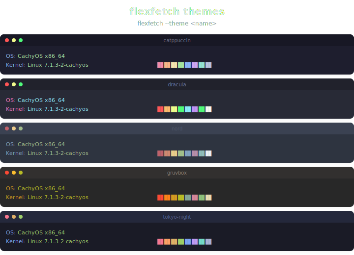

<p align="center">
  
</p>

<h1 align="center">flexfetch</h1>

<p align="center">
  <em>The only system info tool with Lua plugins, Tera templates, and 5 theme presets • Written in Rust</em>
</p>

<p align="center">
  <a href="https://github.com/mahesh-diwan/flexfetch/releases/latest"></a>
  <a href="https://github.com/mahesh-diwan/flexfetch/actions/workflows/release.yml"></a>
  <a href="LICENSE"></a>
  
</p>

<p align="center">
  <a href="#installation"><kbd>Install</kbd></a>
  <a href="#what-makes-flexfetch-unique"><kbd>Unique</kbd></a>
  <a href="#comparison"><kbd>vs Others</kbd></a>
  <a href="#quick-start"><kbd>Quick Start</kbd></a>
  <a href="#usage"><kbd>Usage</kbd></a>
  <a href="#modules"><kbd>Modules</kbd></a>
  <a href="#themes"><kbd>Themes</kbd></a>
  <a href="#configuration"><kbd>Config</kbd></a>
  <a href="#lua-plugins"><kbd>Plugins</kbd></a>
  <a href="#faq"><kbd>FAQ</kbd></a>
</p>

<br>

## Installation

```bash
curl -fsSL https://raw.githubusercontent.com/mahesh-diwan/flexfetch/main/install.sh | sh
```

> Requires `curl` or `wget` + `sudo`. Installs latest pre-built binary from [GitHub Releases](https://github.com/mahesh-diwan/flexfetch/releases).

**From source** (includes Lua plugin support):

```bash
cargo install --git https://github.com/mahesh-diwan/flexfetch
```

**No runtime dependencies.** Static binary (~5 MB) runs anywhere Linux or macOS.

---

## What makes flexfetch unique

Most system info tools do the same thing — show OS, kernel, uptime. flexfetch goes further with three features no other tool offers:

|     | Feature             | What it means                                                                                                                                                         |
| --- | ------------------- | --------------------------------------------------------------------------------------------------------------------------------------------------------------------- |
| 🔌  | **Lua plugins**     | Write custom info modules in Lua 5.4. No compilation, no Bash scripting. Drop a `.lua` file in `~/.config/flexfetch/plugins/` and it appears in output.               |
| 📝  | **Tera templates**  | Full control over output layout. Jinja2/Django syntax. Variables, conditionals, iteration — your output, your way. Default template renders side-by-side logo + info. |
| 🎭  | **5 theme presets** | Catppuccin, Dracula, Nord, Gruvbox, Tokyo Night. Per-field overrides with named colors (`"yellow"`, `"bright_red"`, `"bold"`). Switch with `--theme dracula`.         |
| ⚡  | **Rust + Rayon**    | Static binary, zero runtime deps, parallel info collection. ~5 MB, no Python, no Node, no Bash.                                                                       |

---

## Comparison

|                    | flexfetch              | neofetch        | fastfetch      | pfetch     |
| ------------------ | ---------------------- | --------------- | -------------- | ---------- |
| **Language**       | Rust                   | Bash            | C              | sh         |
| **Plugins**        | ✅ Lua 5.4             | —               | —              | —          |
| **Templates**      | ✅ Tera (Jinja2)       | —               | —              | —          |
| **Theme presets**  | ✅ 5 + named overrides | built-in colors | custom presets | 3 env vars |
| **Config**         | TOML                   | —               | JSON5          | env vars   |
| **ASCII logos**    | 7 + generic            | large set       | large set      | small set  |
| **Parallel**       | ✅ Rayon               | —               | ✅             | —          |
| **Output formats** | text, JSON             | text            | text, JSON     | text       |
| **Binary size**    | ~5 MB                  | ~1 MB (script)  | ~2 MB          | ~5 KB      |

---

## Quick Start

```bash
flexfetch
```

Shows OS, kernel, host, uptime, locale, colors with distro ASCII art + Catppuccin theme.

```bash
flexfetch --theme dracula        # switch theme
flexfetch -f json                # machine-readable JSON
flexfetch -m "os:kernel:uptime"  # specific modules only
flexfetch --gen-config           # generate ~/.config/flexfetch/config.toml
flexfetch --list-modules         # show all available modules
```

<p align="center">
  
</p>

---

## Usage

```
flexfetch [OPTIONS]
```

| Option                  | Description                                                             |
| ----------------------- | ----------------------------------------------------------------------- |
| `-f, --format <FMT>`    | Output: `text` (default) or `json`                                      |
| `-m, --modules <LIST>`  | Colon-separated modules, e.g. `os:kernel:uptime`                        |
| `-c, --config <FILE>`   | Custom config path                                                      |
| `-t, --template <NAME>` | Template name from `~/.config/flexfetch/templates/`                     |
| `--theme <NAME>`        | Color preset: `catppuccin`, `dracula`, `nord`, `gruvbox`, `tokyo-night` |
| `--debug`               | Show per-module errors                                                  |
| `--gen-config`          | Generate default config to `~/.config/flexfetch/`                       |
| `--list-modules`        | List built-in modules                                                   |
| `--list-plugins`        | List Lua plugins                                                        |
| `-h, --help`            | Print help                                                              |
| `-V, --version`         | Print version                                                           |

---

## Modules

| Module                                                                                                                   | Status   | Output                                                                        |
| ------------------------------------------------------------------------------------------------------------------------ | -------- | ----------------------------------------------------------------------------- |
| `os`                                                                                                                     | ✅       | name, version, ID, arch                                                       |
| `host`                                                                                                                   | ✅       | hostname                                                                      |
| `kernel`                                                                                                                 | ✅       | kernel version + arch                                                         |
| `uptime`                                                                                                                 | ✅       | human-readable uptime                                                         |
| `locale`                                                                                                                 | ✅       | language + encoding                                                           |
| `colors`                                                                                                                 | ✅       | 16-color terminal block row                                                   |
| `cpu`, `memory`, `disk`, `gpu`, `network`, `battery`, `processes`, `packages`, `shell`, `terminal`, `de`, `wm`, `custom` | 🚧 stubs | return empty — [PRs welcome](https://github.com/mahesh-diwan/flexfetch/pulls) |
| `title`, `separator`                                                                                                     | 📐       | template-only (header row, divider)                                           |

Modules run in parallel via Rayon. Order determined by `modules` list in config.

---

## Logo Support

flexfetch detects distro from `/etc/os-release` and renders ASCII art next to system info (3-char gap, colored by theme).

| Distro     | Lines | Matches                                                           |
| ---------- | ----- | ----------------------------------------------------------------- |
| Arch Linux | 5     | `arch`, `cachyos`, `endeavouros`, `arcolinux`, `artix`, `manjaro` |
| Debian     | 5     | `debian`, `raspbian`                                              |
| Ubuntu     | 5     | `ubuntu`, `linuxmint`, `pop`, `elementary`, `zorin`               |
| Fedora     | 6     | `fedora`                                                          |
| NixOS      | 5     | `nixos`                                                           |
| macOS      | 6     | auto-detected                                                     |
| Generic    | 6     | any other                                                         |

---

## Themes

5 presets, switchable at runtime via `--theme` or config `display.theme`. Same output, dramatically different look.

<p align="center">
  
</p>

| Theme         | Title       | Keys   | Values | Separator |
| ------------- | ----------- | ------ | ------ | --------- |
| `catppuccin`  | bold pink   | blue   | cyan   | gray      |
| `dracula`     | bold pink   | pink   | cyan   | gray      |
| `nord`        | bold blue   | blue   | green  | gray      |
| `gruvbox`     | bold yellow | yellow | green  | gray      |
| `tokyo-night` | bold pink   | blue   | cyan   | gray      |

Override any preset with named colors:

```toml
[display]
theme = "catppuccin"
color_keys = "yellow"      # named: black, red, green, yellow, blue, magenta, cyan, white, bright_*, bold
color_values = "green"     # or raw ANSI: "\u001b[92m"
```

---

## Configuration

Config at `~/.config/flexfetch/config.toml`. Generate with `flexfetch --gen-config`.

```toml
modules = ["title", "separator", "os", "host", "kernel", "uptime",
           "packages", "shell", "terminal", "de", "cpu", "memory",
           "disk", "colors"]

[display]
separator = ": "
key_width = 8
theme = "catppuccin"

[cache]
ttl = 60               # seconds, 0 = disabled

[custom]
my_temp = { command = "sensors | grep temp1", label = "Temp" }
sys_load = { command = "uptime | awk -F'load average:' '{print $2}'", label = "Load" }
```

Cache: JSON file at `~/.cache/flexfetch/flexfetch-cache.json`. Reduces repeated disk reads.

---

## Lua Plugins

Place `.lua` files in `~/.config/flexfetch/plugins/`. Seen by `flexfetch --list-plugins`.

```lua
-- ~/.config/flexfetch/plugins/user.lua
return {
    name = "user",
    collect = function(ctx)
        local user = ctx.get_env("USER")
        local shell = ctx.get_env("SHELL")
        return { value = user .. " (" .. shell .. ")" }
    end
}
```

**Plugin API:**

| Function               | Returns | Description              |
| ---------------------- | ------- | ------------------------ |
| `ctx.read_file(path)`  | string  | Read file contents       |
| `ctx.run_command(cmd)` | string  | Execute shell command    |
| `ctx.get_env(key)`     | string  | Get environment variable |

Built with `mlua` 0.10 (Lua 5.4). Disable Lua support: `cargo build --release --no-default-features`.

---

## Templates

Default template uses [Tera](https://tera.netlify.app/) (Jinja2/Django). Output side-by-side logo + info.

**Context variables:**

- Scalar: `kernel`, `host`, `uptime` — plain string
- Map: `os.*`, `locale.lang` — nested fields
- Theme: `theme_title`, `theme_keys`, `theme_values`, `theme_sep`, `theme_reset`
- Display: `display_separator`, `display_key_width`

Place custom templates in `~/.config/flexfetch/templates/`, use `flexfetch -t my_template`.

---

## Project Structure

```
flexfetch/
├── Cargo.toml                    # workspace manifest
├── flexfetch-core/               # detection library
│   └── src/
│       ├── lib.rs                # crate root + re-exports
│       ├── module.rs             # Module trait, InfoValue, SystemInfo
│       ├── module_registry.rs    # registry + parallel dispatch (Rayon)
│       ├── config.rs             # TOML config loader
│       ├── context.rs            # runtime context (dirs, cache)
│       ├── template.rs           # Tera engine + logo overlay
│       ├── logo.rs               # distro ASCII art
│       ├── theme.rs              # 5 presets + ANSI resolution
│       ├── cache.rs              # file-backed JSON cache
│       ├── error.rs              # error types
│       └── modules/              # detection modules
├── flexfetch-cli/                # CLI binary
│   └── src/main.rs
├── flexfetch-lua/                # Lua plugin host (optional)
│   └── src/lib.rs
├── templates/default.tera
├── assets/default.svg
├── assets/json.svg
└── assets/themes.svg
```

## Building

```bash
cargo build --release
cargo build --release --no-default-features   # without Lua
cargo test
```

## FAQ

**Q: How is this different from neofetch/fastfetch?**
Lua plugins + Tera templates + theme presets. No other tool has all three. See [comparison](#comparison).

**Q: How do I change colors?**
`--theme dracula` or set `display.theme` in config. Per-field overrides with named colors.

**Q: How do I add info that isn't built in?**
Two ways: `[custom]` section in config (shell commands), or Lua plugin in `~/.config/flexfetch/plugins/`.

**Q: Why are some modules empty?**
13 modules are stubs — they compile but return empty. Implementation guide [here](https://github.com/mahesh-diwan/flexfetch/pulls). Fork, implement the `Module` trait, submit PR.

**Q: Does it work on macOS?**
Yes. OS detection via `sw_vers`, hostname via POSIX. macOS logo auto-detected.

## License

MIT

## Credits

- [neofetch](https://github.com/dylanaraps/neofetch) — design inspiration
- [fastfetch](https://github.com/fastfetch-cli/fastfetch) — Rust reference
- [pfetch](https://github.com/dylanaraps/pfetch) — minimal design
- [Tera](https://tera.netlify.app/) — template engine
- [mlua](https://github.com/khvzak/mlua) — Lua bindings
- [Catppuccin](https://github.com/catppuccin/catppuccin), [Dracula](https://draculatheme.com/), [Nord](https://www.nordtheme.com/), [Gruvbox](https://github.com/morhetz/gruvbox), [Tokyo Night](https://github.com/enkia/tokyo-night-vscode-theme) — color palettes
