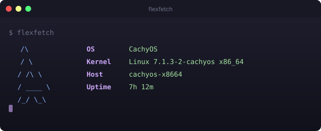
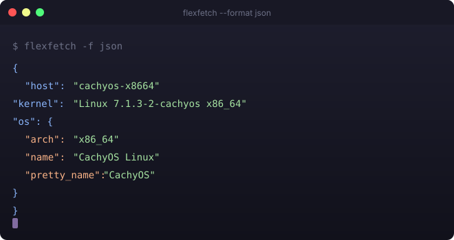
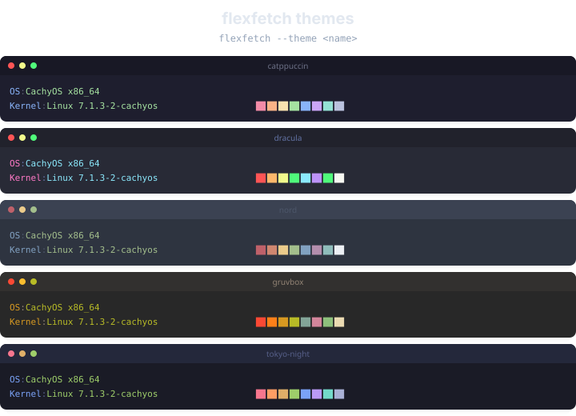

<p align="center">
  
</p>

<h1 align="center">flexfetch</h1>

<p align="center">
  <em>Your system info, your rules.</em><br>
  Lua + WASM plugins · Tera templates · 27 theme presets · 527+ ASCII logos · Written in Rust
</p>

<p align="center">
  <a href="#installation"><kbd>Install in one line →</kbd></a>
</p>

<p align="center">
  <a href="https://github.com/mahesh-diwan/flexfetch/releases/latest"></a>
  <a href="https://github.com/mahesh-diwan/flexfetch/actions/workflows/release.yml"></a>
  <a href="LICENSE"></a>
  
</p>

<br>

## Installation

```bash
curl --proto '=https' --tlsv1.2 -sSfL https://github.com/mahesh-diwan/flexfetch/releases/latest/download/install.sh | sh
```

Installs the latest release binary (~2 MB, statically linked) from
[GitHub Releases](https://github.com/mahesh-diwan/flexfetch/releases). The script is
**idempotent**: re-run it to update in place (it compares versions, backs up the old
binary, and verifies the SHA-256 checksum of the download). Requires `curl` (or
`wget`) and write access to `/usr/local/bin` (falls back to `~/.local/bin`).
Works on Linux and macOS.

📖 **Full documentation:** [mdBook docs site](https://mahesh-diwan.github.io/flexfetch/) — modules, templates, plugins, CLI reference, feature flags.

**From source** (includes Lua plugin support):

```bash
cargo install --git https://github.com/mahesh-diwan/flexfetch
```

**Try it:**

```bash
flexfetch --theme dracula
flexfetch -f json
flexfetch -m "os:kernel:uptime"
flexfetch --list-modules
flexfetch --gen-config
```

<p align="center">
  
</p>

<br>

---

## Why flexfetch?

Every system info tool shows the same thing — OS, kernel, uptime, done. flexfetch gives you three things no other tool does:

|     | Feature             | What it means                                                                                                                      |
| --- | ------------------- | ---------------------------------------------------------------------------------------------------------------------------------- |
| 🔌  | **Lua + WASM plugins** | Write info modules in Lua (drop a `.lua` file in `~/.config/flexfetch/plugins/`) or sandboxed WebAssembly (`.wasm`, fuel + memory limited, capability-gated imports — opt-in via `--features wasm-plugins`). No compilation. No Bash. |
| 📝  | **Tera templates**  | Jinja2-style templates. Variables, loops, conditionals. Default template renders side-by-side logo + info with right-aligned keys. |
| 🎭  | **27 theme presets**| Catppuccin, Dracula, Nord, Gruvbox, Tokyo Night, Solarized, Rose Pine, Monokai, One Dark, Kanagawa + more. Switch with `--theme`. Per-field overrides with named colors. |
| ⚡  | **Rust + Rayon**    | Parallel detection. Static binary, zero runtime deps. ~1.5 MB minimal / ~6 MB full. No Python, no Node, no Bash.                     |

<br>

## Comparison

|                       | flexfetch                      | neofetch       | fastfetch       | pfetch   |
| --------------------- | ------------------------------ | -------------- | --------------- | -------- |
| **Language**          | Rust                           | Bash           | C               | sh       |
| **Lua plugins**       | ✅                             | —              | —               | —        |
| **Tera templates**    | ✅                             | —              | —               | —        |
| **Theme presets**     | ✅ 27 + named overrides       | built-in       | JSON5 presets   | 3 env    |
| **Parallel**          | ✅ Rayon                       | —              | ✅              | —        |
| **Output formats**    | text, JSON, MD, SVG, HTML, PNG | text           | text, JSON      | text     |
| **Config**            | TOML                           | —              | JSON5           | env vars |
| **ASCII logos**       | 527 + image support            | ~150           | ~200            | small    |
| **Binary size**       | 1.5–6 MB (by features)         | ~1 KB (script) | 2 MB            | 5 KB     |
| **Runtime deps**      | none                           | Bash + utils   | none            | sh       |
| **Watch mode**        | ✅                             | —              | —               | —        |
| **Shell completions** | bash, zsh, fish                | —              | bash, zsh, fish | —        |

<br>

---

## Themes

27 presets. Same output, dramatically different look. Switch at runtime:

```bash
flexfetch --theme nord
flexfetch --theme tokyo-night
flexfetch --theme gruvbox
```

<p align="center">
  
</p>

Override any preset with named colors:

```toml
[display]
theme = "catppuccin"
color_keys = "yellow"
color_values = "green"
color_sep = "red"
```

Colors resolve from a named set (`black`/`red`/`green`/`yellow`/`blue`/`magenta`/`cyan`/`white` + `bright_*` + `bold`). Or use raw ANSI escapes: `"\u001b[92m"`.

| Theme         | Keys   | Values |
| ------------- | ------ | ------ |
| `catppuccin`  | pink   | cyan   |
| `dracula`     | pink   | cyan   |
| `nord`        | blue   | green  |
| `gruvbox`     | yellow | green  |
| `tokyo-night` | blue   | cyan   |

<br>

---

## Lua Plugins

Write custom info modules in Lua 5.4. No compilation, no Bash scripting.

```lua
-- ~/.config/flexfetch/plugins/user.lua
return {
    name = "user",
    collect = function(ctx)
        local user = ctx.get_env("USER")
        local shell = ctx.get_env("SHELL")
        return { value = user .. " (" .. shell .. ")" }
    end
}
```

**Plugin API:**

| Function               | Returns | Description              |
| ---------------------- | ------- | ------------------------ |
| `ctx.read_file(path)`  | string  | Read file contents       |
| `ctx.run_command(cmd)` | string  | Execute shell command    |
| `ctx.get_env(key)`     | string  | Get environment variable |

List plugins: `flexfetch --list-plugins`. Shrink the binary at build time with `cargo build --release -p flexfetch-cli --no-default-features` — this drops Lua, the live dashboard, image logos, the Tera template engine (plain `├─` fallback renderer), and Rayon (sequential collection) for a **~1.5 MB** minimal binary. Note: prebuilt binaries from `install.sh`/Releases are built without Lua and without tera/rayon but WITH the live dashboard, image logos, and shell-completion generation; source builds (`cargo install --git`) include everything by default (default builds compile vendored Lua, so a C compiler is required).

Built with [mlua](https://github.com/khvzak/mlua) 0.10 (Lua 5.4).

### PGO build

Profile-Guided Optimization rebuild (instrumented run + profile-use rebuild,
plus a before/after size & timing report) — needs `llvm-profdata`:

```bash
./scripts/pgo.sh                 # 100 instrumented runs per workload
PROFILE_RUNS=20 ./scripts/pgo.sh # fewer runs for a quicker pass
```

`PGO_DIR` (default `/tmp/pgo`) overrides the profile output location.

<br>

---

## WASM Plugins

Write plugins in any language that compiles to `wasm32-unknown-unknown`
(Rust, C, Zig, …). Drop a `.wasm` file in `~/.config/flexfetch/plugins/` and it
appears in output — **sandboxed**: fuel-limited execution, a hard memory cap,
and host imports that are capability-gated (a plugin can only call what it was
granted; by default that's `log` + env reads — no filesystem, no commands).

Build with the opt-in feature (wasmtime is a heavy dependency tree, so it stays
out of default/minimal builds):

```bash
cargo build --release --features wasm-plugins
```

**ABI (v1)** — export `memory` + `flexfetch_plugin()` returning a packed
`(len << 32) | ptr` to a JSON doc in your memory (`{"value": "x"}` for a scalar,
a flat object for a map, an array for a list). Available host imports, in the
`flexfetch` namespace:

| Function      | Capability | Notes                                    |
| ------------- | ---------- | ---------------------------------------- |
| `log`         | always     | writes to flexfetch's stderr             |
| `env_get`     | `Env`      | read an env var (default sandbox grants) |
| `read_file`   | `File`     | read a file (NOT granted by default)     |
| `run_command` | `Command`  | run a shell command (NOT granted by default) |

A plugin that imports something it wasn't granted fails to load (and is
skipped with a debug note) — broken or malicious plugins can't take down the
fetch. Lua and WASM plugins mix freely; both render into the output's Plugins
section. Publish either through `flexfetch plugin search|install|update`.

<br>

---

## Plugin Registry

Install, search, and update Lua plugins from the hosted registry. Every
download is **SHA-256 verified** and `min_flexfetch_version`-gated, and signed
entries are **Ed25519-verified** against the project's embedded publisher key
before anything touches disk:

```bash
flexfetch plugin search cpu       # search the registry by name/description
flexfetch plugin install hello    # install to ~/.config/flexfetch/plugins/
flexfetch plugin list             # installed plugins + registry status
flexfetch plugin update           # re-install every installed plugin in the registry
```

Publishing a plugin: open a PR against `registry/plugins.toml` and sign your
plugin with the publisher tool (`cargo run --example registry_sign -- your.lua
<seed-hex>` prints the base64 signature to paste into the entry). Unsigned
entries still install (sha256-only, with a notice) for backwards compatibility.

<br>

---

## Templates

Full control over output layout with [Tera](https://tera.netlify.app/) (Jinja2/Django syntax). Default template renders side-by-side logo + info with right-aligned labels.

**Context variables:**

- **Scalars:** `kernel`, `host`, `uptime`
- **Maps:** `os.pretty_name`, `locale.lang`, `shell.name`, `cpu.model`, `memory.used`
- **Theme:** `theme_keys`, `theme_values`, `theme_reset`, `theme_title`, `theme_sep`
- **Display:** `display_separator`, `display_key_width`

Place custom templates in `~/.config/flexfetch/templates/`:

```bash
flexfetch -t my_template
```

Default template path: `~/.config/flexfetch/templates/default.tera`.

<br>

---

## Custom Modules (no code)

Define info sources inline in config. No plugin needed.

```toml
[custom]
my_temp = { command = "sensors | grep temp1", label = "Temp" }
sys_load = { command = "uptime | awk -F'load average:' '{print $2}'", label = "Load" }
```

Each custom module runs the shell command on every fetch and displays the result.

<br>

---

## Configuration

Config at `~/.config/flexfetch/config.toml`. Generate with `flexfetch --gen-config`.

```toml
modules = ["title", "separator", "os", "host", "kernel", "uptime",
           "shell", "cpu", "memory", "colors"]

[display]
separator = ": "
key_width = 8
theme = "catppuccin"

[cache]
ttl = 60               # seconds, 0 to disable
```

Cache is a JSON file at `~/.cache/flexfetch/`. Reduces repeated disk reads. TTL = 60s by default.

<br>

---

## Watch Mode

Refresh output periodically (useful for dashboards):

```bash
flexfetch --watch              # refresh every 2 seconds
flexfetch --watch --watch-interval 5  # refresh every 5 seconds
```

Press `Ctrl+C` to stop. Both `--watch` and `--live` hot-reload the config file:
edit `~/.config/flexfetch/config.toml` and the change is picked up on the next
refresh (mtime-based, no external watcher).

<br>

---

## Smart Fetch

Show context-relevant info based on the current directory:

```bash
flexfetch --smart
```

Adds three modules to the normal output (dedup'd — works with any preset or `--modules`):

| Module    | Shows                                                                  |
| --------- | ---------------------------------------------------------------------- |
| `git`     | Branch, ahead/behind vs upstream, dirty file count (via the `git` CLI)  |
| `project` | Project type from manifests (`Cargo.toml`, `package.json`, `go.mod`, …) |
| `context` | Container, Python virtualenv, SSH session                               |

Empty results are omitted, so nothing extra renders outside a project/container.

<br>

---

## Health Score

A 0–100 system health score from disk usage, swap, load, and battery:

```bash
flexfetch --health
```

```
├─󰐗 Health: 92/100 (Excellent) — disk 87%
```

Score starts at 100 and deducts for disk >90%, swap >50%, load >1/core, or
battery <80%. A grade (Excellent/Good/Fair/Poor) and the contributing notes are
shown. It's also a regular module — add `health` to your module list or presets.

<br>

---

## Update, Doctor & Shell Hooks

Keep flexfetch current and self-diagnose your environment:

```bash
flexfetch --update          # re-run the idempotent install script (no-op when current)
flexfetch --doctor          # check TTY, truecolor, Nerd Font, config, core collectors
flexfetch --hook zsh        # print a cd-into-git-repo snippet (bash | zsh | fish)
eval "$(flexfetch --hook zsh)"   # add to your shell rc
```

`--doctor` exits nonzero if a hard check fails (color, config, collectors) so it
can be wired into setup scripts; terminal and Nerd Font are informational. The
`--hook` snippet runs `flexfetch --prompt` whenever you `cd` into a git
repository.

<br>

---

## Shell Prompt & MOTD

```bash
flexfetch --prompt            # cachyos | CPU 12% | RAM 3.2 GiB/15.3 GiB
PS1="$(flexfetch --prompt) $ "
flexfetch --motd              # plain-text banner (ANSI stripped)
```

`--prompt` prints a single ANSI-free line (OS | CPU | RAM) for shell prompts.
`--motd` renders the normal output with all ANSI colors stripped — drop it in
`/etc/motd` or your shell startup.

<br>

---

## Remote Fetch over SSH

```bash
flexfetch --ssh server1 --ssh server2        # parallel, per-host headers
flexfetch --ssh host "--modules os:kernel"   # JSON round-trip over ssh
```

Runs `flexfetch --format json` on each remote host and renders it locally. If a
host lacks flexfetch, flexfetch falls back to scp'ing the current binary and
running it from `/tmp`. Hosts are fetched in parallel (one thread each).

<br>

---

## Config Wizard

```bash
flexfetch --wizard
```

Interactive 4-step wizard (ratatui): module checklist, theme picker with live
preview, layout (box style + frame), then writes `~/.config/flexfetch/config.toml`.

- `↑/↓` move · `space` toggle · `a` select all · `enter` next · `q`/`Esc` quit

<br>

---

## Live Dashboard

Real-time system monitor — CPU and memory gauges with 60-sample sparklines, top
processes by CPU, and per-interface network throughput:

```bash
flexfetch --live
```

- `q` / `Esc` — quit
- `Space` — refresh immediately (rates and CPU% are computed from actual elapsed
  time, so a manual refresh is always accurate)

Data sources are Linux `/proc` + `/sys` (CPU ticks, per-process `stat`/`statm`,
interface byte counters); the memory gauge reuses the existing `memory` collector.
The dashboard is gated behind the `live` feature (default on) — `--no-default-features`
drops ratatui/crossterm entirely for the minimal binary. Similarly, image logos
(sixel/block) and `--export png` are gated behind the `image-logos` feature (default
on); without it, image logos fall back to ASCII (kitty/iTerm2 still work) and PNG
export prints a clear "requires the image-logos feature" message.

**Record the dashboard** as an asciinema v2 cast (share/replay with `asciinema play`):

```bash
flexfetch --live --record session.cast
```

<br>

---

## Output Formats

| Format     | Use case                     |
| ---------- | ---------------------------- |
| `text`     | Terminal (default)           |
| `json`     | Scripts, tooling             |
| `github`   | GitHub Actions log block     |
| `markdown` | Documentation, GitHub README |
| `svg`      | Vector graphics              |
| `html`     | Web embedding                |
| `png`      | Screenshots                  |

JSON mode disables ASCII art and themes. Output is structured for parsing:

```bash
flexfetch -f json | jq '.os.name'
flexfetch -f markdown > system-info.md
flexfetch -f github          # ::group:: block for GitHub Actions logs
```

<br>

---

## GitHub Action

Drop flexfetch into any CI workflow to show runner system info as a foldable,
colorized `::group::` block in the job log (needs no extra setup — the format
uses standard GitHub log annotations):

```yaml
steps:
  - uses: mahesh-diwan/flexfetch@main
    with:
      format: github   # github (default) | markdown | json
      theme: catppuccin
      modules: os,kernel,cpu,memory,disk
```

The composite action (`packaging/flexfetch-action/action.yml`) installs flexfetch
when missing and runs `flexfetch --format github`. The raw export is also
available standalone: `flexfetch -f github`.

<br>

---

## Tmux Integration

Show a compact fetch in every new idle tmux pane:

```bash
flexfetch --tmux-config >> ~/.tmux.conf
```

The snippet (`run-shell ~/.local/bin/flexfetch-tmux`) runs the bundled
`flexfetch-tmux` helper in each new pane — it only prints the fetch when the
pane is idle (its current command is a shell), so long-running commands are
never disturbed. The helper is installed next to the main binary by `install.sh`.

<br>

---

## Hardware Database

flexfetch resolves GPU vendor/device IDs to friendly model names via a
crowdsourced hardware DB (bundled seed + cached copy). Refresh the cache from
the latest DB on the repo:

```bash
flexfetch --update-db     # needs curl; writes ~/.cache/flexfetch/hardware.json
```

When offline, lookups fall back to the bundled seed, then to raw hex/driver
names. Point `FLEXFETCH_HWDB_URL` at a mirror to override the download source.

<br>

---

## Modules

All modules run in parallel via Rayon and detect from your system automatically.

| Module                                                                                                         | Status |
| -------------------------------------------------------------------------------------------------------------- | ------ |
| `os`, `host`, `kernel`, `uptime`, `locale`                                                                     | ✅     |
| `cpu`, `memory`, `disk`, `gpu`, `network`, `battery`, `processes`, `packages`, `shell`, `terminal`, `de`, `wm` | ✅     |
| `colors`                                                                                                       | ✅     |
| `custom`                                                                                                       | ✅     |
| `title`, `separator`                                                                                           | 📐     |
| `health` (disk/swap/load/battery score)                                                                         | ✅     |
| `git`, `project`, `context` (via `--smart`)                                                                     | ✅     |

<br>

---

## Logo Support

flexfetch detects distro from `/etc/os-release` and renders ASCII art next to info. **527+ distros** supported (imported from fastfetch's logo set, MIT licensed), plus custom high-quality logos for the majors:

| Source     | Count                                                              |
| ---------- | ------------------------------------------------------------------ |
| fastfetch  | 527+ distro logos (auto-generated from fastfetch's set)            |
| Custom     | high-quality Arch, Debian, Ubuntu, Fedora, NixOS, macOS + more     |

Image logos render as truecolor block art in terminals with 24-bit color support
(Kitty / iTerm2 / Sixel / block-character protocols). Falls back to ASCII if no
image file exists. Override any logo by dropping a file in
`~/.config/flexfetch/logos/`.

<br>

---

## Building

```bash
cargo build --release                     # all features (lua, live, image-logos, tera, parallel, completions)
cargo build --release --no-default-features  # minimal ~1.5 MB: no Lua, no TUI, no image crate, no tera/rayon
# opt in selectively, e.g.:
cargo build --release --no-default-features --features live,image-logos,completions  # what releases ship
cargo test
```

Without the `image-logos` feature, sixel/block image logos degrade to ASCII and
`--export png` is unavailable (clear error) — kitty/iTerm2 image protocols still
work since they only base64 the raw bytes. This is what lets the minimal build drop
the `image` crate entirely.

<br>

---

## Shell Completions

Tab completion for bash, zsh, and fish. Regenerate fresh copies from the
installed binary (the `completions` subcommand ships in default builds):

```bash
flexfetch completions bash > completions/flexfetch.bash
flexfetch completions zsh  > completions/flexfetch.zsh
flexfetch completions fish > completions/flexfetch.fish
```

Or use the pre-generated files in the repo `completions/` directory:

```bash
# Bash
source completions/flexfetch.bash

# Zsh
source completions/flexfetch.zsh

# Fish
source completions/flexfetch.fish
```

Install permanently:

```bash
# Bash (Ubuntu/Debian)
cp completions/flexfetch.bash /etc/bash_completion.d/

# Zsh
cp completions/flexfetch.zsh /usr/share/zsh/vendor-completions/

# Fish
cp completions/flexfetch.fish ~/.config/fish/completions/
```

<br>

---

## Man Page

```bash
man doc/flexfetch.1
```

<br>

---

## FAQ

**How is this different from neofetch/fastfetch?** Lua plugins, Tera templates, and 27 theme presets — no other tool has all three.

**How do I add info that isn't built in?** Two ways: `[custom]` config section (shell commands) or a Lua plugin.

**Does it work on macOS?** Yes. OS detection via `sw_vers`. macOS logo auto-detected.

**Does it work on Windows?** Yes (Tier-2). OS/CPU info via the registry, memory via
`GlobalMemoryStatusEx`, disk via `GetDiskFreeSpaceExW`, network via
`GetAdaptersInfo` — zero subprocesses, and Windows Terminal/ConEmu are detected.
Validated in CI on a `windows-latest` runner (the release feature set, pure-Rust
deps).

<br>

---

<p align="center">
  <b>flexfetch</b> — MIT licensed<br>
  <sub>Inspired by <a href="https://github.com/dylanaraps/neofetch">neofetch</a>, <a href="https://github.com/fastfetch-cli/fastfetch">fastfetch</a>, and <a href="https://github.com/dylanaraps/pfetch">pfetch</a></sub><br>
  <sub>Built with <a href="https://www.rust-lang.org/">Rust</a>, <a href="https://tera.netlify.app/">Tera</a>, <a href="https://github.com/khvzak/mlua">mlua</a>, <a href="https://github.com/rayon-rs/rayon">Rayon</a></sub><br>
  <br>
  <a href="https://github.com/mahesh-diwan/flexfetch/stargazers">⭐ Star on GitHub</a>
</p>
